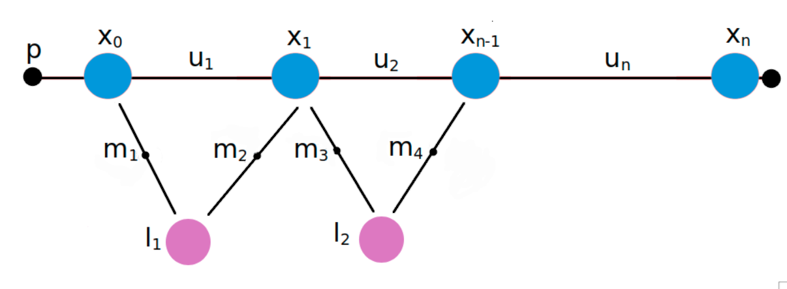

# **Graph-based SLAM (2D)** #

This repository contains conversion of [airlab summer school 2020 gtsam/slam](https://theairlab.org/summer2020/#2.3) matlab scripts to the python scripts.
For more detailed theoretical information, you can read ["A Tutorial on Graph-Based SLAM"](http://www2.informatik.uni-freiburg.de/~stachnis/pdf/grisetti10titsmag.pdf) article 
and take a look at ["Mobile Sensing and Robotics 2"](https://youtube.com/playlist?list=PLgnQpQtFTOGQh_J16IMwDlji18SWQ2PZ6) -
[Graph-based SLAM using Pose Graphs](https://youtu.be/uHbRKvD8TWg) and [Graph-Based SLAM with Landmarks](https://youtu.be/mZBdPgBtrCM) lessons that given by Cyrill Stachniss at the University of Bonn.

Graph-based SLAM : Build the graph and find a node configuration that minimize the error introduced by the constraints.

$x_n =$ robot poses

$u_n =$ odometry measurements 

$m_n =$ landmark measurements 

$l_n =$ landmark positions 

Detailed information is available in the jupyter notebook.
